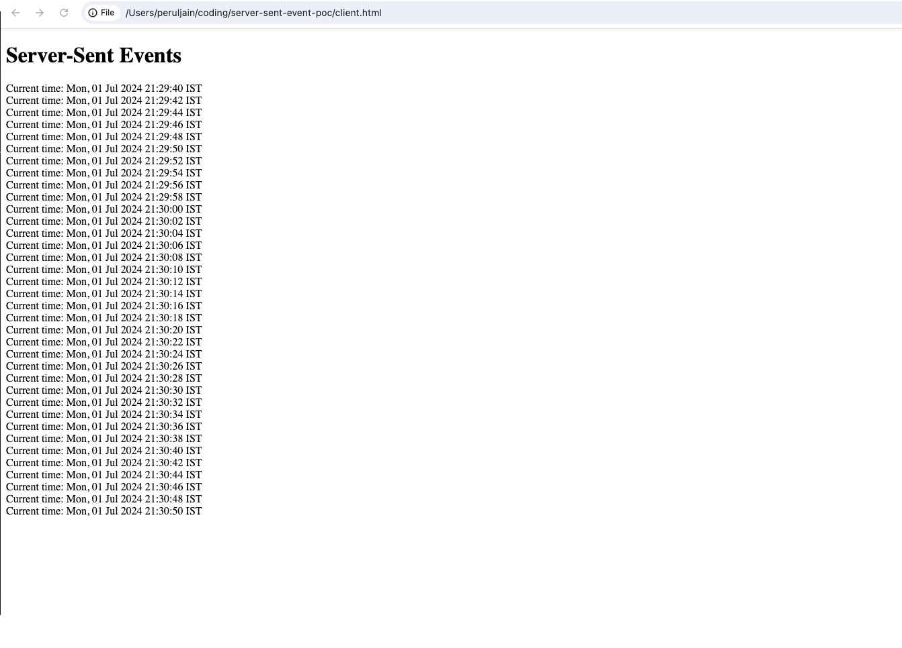

# Problem Statement
Developed a POC for sending server-sent events to client

# Approach

1. Create go server which will send timestamp t0 client in every 2 seconds
2. Create simple html which will show timestamp in browser

# Steps to run

1. go run main.go